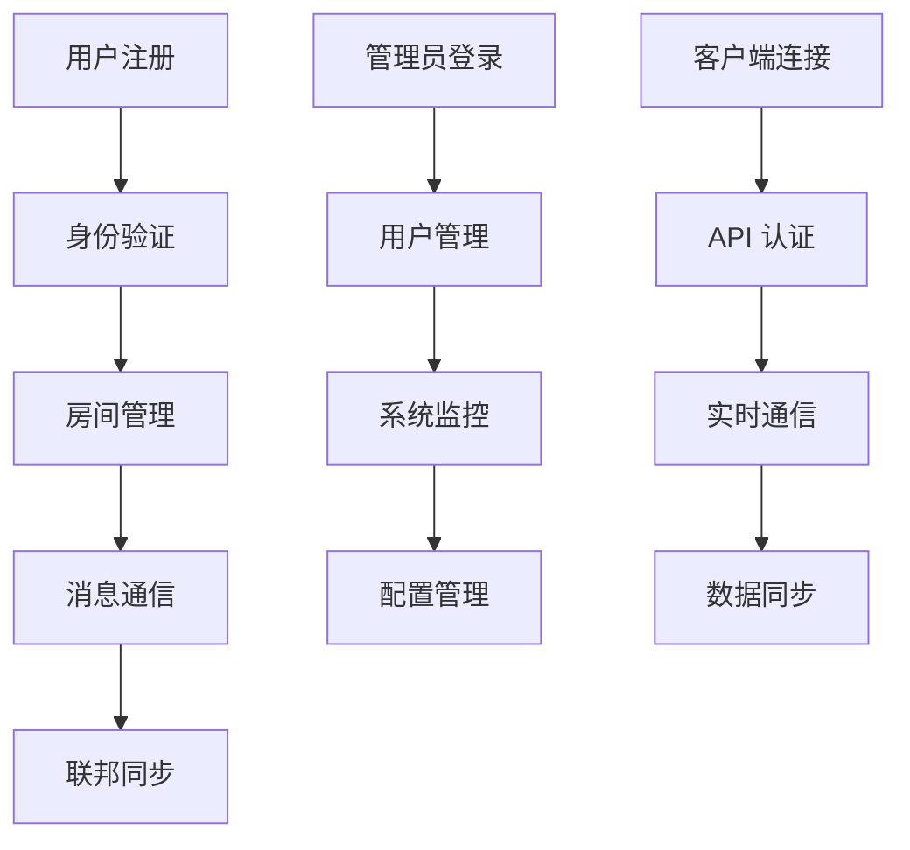

# Matrix Synapse 产品需求文档

## 1. 产品概述

Matrix Synapse 是一个开源的去中心化实时通信服务器，实现了 Matrix 协议标准。本项目旨在为用户提供一个易于部署、高性能、安全可靠的即时通信解决方案，支持文本消息、文件传输、音视频通话等功能。

项目解决了传统中心化通信平台的数据隐私和服务依赖问题，让用户能够完全控制自己的通信数据，同时保持与全球 Matrix 网络的互联互通能力。

目标市场价值：为个人用户、小团队、企业和组织提供私有化的通信服务，满足数据主权和隐私保护的需求。

## 2. 核心功能

### 2.1 用户角色

| 角色 | 注册方式 | 核心权限 |
|------|----------|----------|
| 普通用户 | 开放注册（限制频率） | 创建和加入房间、发送消息、文件传输 |
| 管理员用户 | 命令行创建 | 用户管理、服务器配置、房间管理、联邦控制 |
| 访客用户 | 邀请链接 | 仅查看公开房间内容（可选功能） |

### 2.2 功能模块

本 Matrix Synapse 服务包含以下核心页面和功能模块：

1. **用户管理界面**: 用户注册、登录认证、个人资料管理
2. **房间管理界面**: 房间创建、设置、成员管理、权限控制
3. **消息通信界面**: 实时消息发送、文件传输、消息历史
4. **联邦网络界面**: 跨服务器通信、服务器发现、联邦设置
5. **管理控制界面**: 服务器监控、用户管理、系统配置
6. **API 接口**: RESTful API、WebSocket 连接、客户端 SDK

### 2.3 页面详情

| 页面名称 | 模块名称 | 功能描述 |
|----------|----------|----------|
| 用户管理界面 | 用户注册 | 支持邮箱注册，10分钟频率限制，密码强度验证 |
| 用户管理界面 | 用户认证 | 登录验证，会话管理，多设备支持，安全登出 |
| 用户管理界面 | 个人资料 | 显示名称设置，头像上传，隐私设置，账户安全 |
| 房间管理界面 | 房间创建 | 公开/私有房间创建，房间别名设置，初始权限配置 |
| 房间管理界面 | 成员管理 | 邀请用户，踢出成员，权限分配，管理员指定 |
| 房间管理界面 | 房间设置 | 房间名称，主题设置，历史可见性，加密配置 |
| 消息通信界面 | 实时消息 | 文本消息发送，表情符号，消息编辑，消息删除 |
| 消息通信界面 | 文件传输 | 图片、文档、音视频文件上传下载，文件预览 |
| 消息通信界面 | 消息历史 | 消息搜索，历史浏览，消息同步，离线消息 |
| 联邦网络界面 | 服务器发现 | Well-known 配置，服务器验证，联邦测试 |
| 联邦网络界面 | 跨服务器通信 | 远程用户邀请，跨服务器房间，联邦事件同步 |
| 管理控制界面 | 用户管理 | 用户列表，账户状态，权限管理，用户统计 |
| 管理控制界面 | 系统监控 | 服务器状态，性能指标，资源使用，错误日志 |
| 管理控制界面 | 配置管理 | 服务器设置，功能开关，安全配置，备份恢复 |
| API 接口 | 客户端 API | Matrix 客户端协议实现，RESTful 接口，认证授权 |
| API 接口 | 联邦 API | 服务器间通信协议，事件同步，密钥交换 |
| API 接口 | 管理 API | 管理员操作接口，批量操作，系统配置 API |

## 3. 核心流程

### 3.1 用户注册和认证流程

用户首先访问客户端应用，选择注册新账户。系统验证注册频率限制（10分钟间隔），用户填写用户名和密码，系统验证密码强度并创建账户。注册成功后，用户可以登录并开始使用服务。

### 3.2 房间创建和管理流程

已认证用户可以创建新房间，设置房间类型（公开/私有）、名称和初始权限。房间创建后，用户可以邀请其他用户加入，设置成员权限，配置房间设置如历史可见性和加密选项。

### 3.3 消息通信流程

用户在房间中发送消息，系统验证用户权限和速率限制，消息通过 Matrix 协议同步到所有房间成员。支持文本消息、文件上传、消息编辑和删除等操作。

### 3.4 联邦通信流程

本地服务器通过 Matrix 联邦协议与其他 Matrix 服务器通信，支持跨服务器的用户邀请和房间参与。系统自动处理服务器发现、密钥验证和事件同步。

## 4. 用户界面设计

### 4.1 设计风格

- **主色调**: 深蓝色 (#1a1a2e) 和亮绿色 (#16213e)
- **辅助色**: 白色 (#ffffff) 和浅灰色 (#f5f5f5)
- **按钮样式**: 圆角矩形，3D 阴影效果
- **字体**: 系统默认字体，标题 18px，正文 14px，小字 12px
- **布局风格**: 卡片式设计，顶部导航栏，响应式布局
- **图标样式**: 简洁的线性图标，统一的视觉风格

### 4.2 页面设计概览

| 页面名称 | 模块名称 | UI 元素 |
|----------|----------|----------|
| 用户管理界面 | 注册表单 | 简洁的表单设计，深蓝色背景，白色输入框，绿色提交按钮，实时验证提示 |
| 用户管理界面 | 登录界面 | 居中布局，品牌 Logo，用户名密码输入，记住登录状态选项 |
| 房间管理界面 | 房间列表 | 卡片式房间展示，房间头像，名称，最后消息预览，未读消息计数 |
| 房间管理界面 | 房间设置 | 标签页设计，基本信息，成员管理，权限设置，高级选项 |
| 消息通信界面 | 聊天窗口 | 消息气泡设计，时间戳，用户头像，文件预览，输入框工具栏 |
| 消息通信界面 | 文件上传 | 拖拽上传区域，进度条显示，文件类型图标，上传状态提示 |
| 管理控制界面 | 仪表板 | 网格布局，统计卡片，图表展示，快速操作按钮 |
| 管理控制界面 | 用户列表 | 表格设计，搜索过滤，批量操作，状态指示器 |

### 4.3 响应式设计

本产品采用移动优先的响应式设计，支持桌面端、平板和手机端访问。在移动端优化触摸交互，调整按钮大小和间距，简化导航结构。桌面端充分利用屏幕空间，提供更丰富的功能和更高效的操作体验。

## 5. 技术要求

### 5.1 性能要求

- **响应时间**: API 响应时间 < 200ms，消息发送延迟 < 100ms
- **并发用户**: 支持 100+ 并发用户（1CPU/2GB 配置）
- **文件上传**: 支持最大 8MB 文件上传（低配）/ 50MB（标准配置）
- **消息吞吐**: 支持每秒 50+ 消息处理
- **存储效率**: 数据库查询优化，索引设计，缓存策略

### 5.2 安全要求

- **数据加密**: 支持端到端加密（E2EE），传输层 TLS 1.3
- **身份验证**: 强密码策略，会话管理，多设备登录控制
- **访问控制**: 基于角色的权限管理，房间级别权限控制
- **速率限制**: 注册、登录、消息发送的频率限制
- **安全审计**: 操作日志记录，安全事件监控

### 5.3 可用性要求

- **服务可用性**: 99.5% 以上的服务可用时间
- **故障恢复**: 自动重启机制，健康检查，故障转移
- **数据备份**: 自动化备份，多重备份策略，快速恢复
- **监控告警**: 实时监控，异常告警，性能分析

### 5.4 兼容性要求

- **Matrix 协议**: 完全兼容 Matrix 1.0+ 协议规范
- **客户端支持**: 支持 Element、FluffyChat 等主流 Matrix 客户端
- **联邦互通**: 与其他 Matrix 服务器的完全互操作性
- **API 标准**: RESTful API 设计，OpenAPI 文档

## 6. 部署要求

### 6.1 系统要求

- **操作系统**: Ubuntu 20.04/22.04/24.04 LTS
- **最低配置**: 1 vCPU / 2 GB RAM / 40 GB 存储
- **推荐配置**: 2 vCPU / 4 GB RAM / 80 GB 存储
- **网络要求**: 公网 IP，域名解析，SSL 证书

### 6.2 部署方式

- **一键部署**: 提供自动化部署脚本，简化安装过程
- **容器化部署**: 基于 Docker 和 Docker Compose
- **配置管理**: 环境变量配置，配置文件模板
- **服务编排**: 多服务协调，依赖管理，健康检查

### 6.3 运维支持

- **监控工具**: 系统监控，应用监控，日志分析
- **备份恢复**: 自动备份脚本，一键恢复功能
- **升级维护**: 滚动升级，配置迁移，兼容性检查
- **故障排查**: 详细的故障排查文档和工具

## 7. 质量保证

### 7.1 测试策略

- **功能测试**: 核心功能验证，用户场景测试
- **性能测试**: 负载测试，压力测试，资源使用测试
- **安全测试**: 渗透测试，漏洞扫描，安全配置检查
- **兼容性测试**: 多客户端测试，联邦互通测试

### 7.2 质量指标

- **功能覆盖率**: 核心功能 100% 可用
- **性能指标**: 满足性能要求的各项指标
- **安全等级**: 通过安全审计和渗透测试
- **用户体验**: 界面友好，操作流畅，文档完善

## 8. 项目里程碑

### 8.1 第一阶段：基础功能

- ✅ 用户注册和认证系统
- ✅ 基础消息通信功能
- ✅ 房间创建和管理
- ✅ 文件上传和下载
- ✅ 基础管理界面

### 8.2 第二阶段：高级功能

- ✅ 联邦网络支持
- ✅ 端到端加密
- ✅ 高级权限管理
- ✅ 性能优化
- ✅ 监控和日志系统

### 8.3 第三阶段：企业功能

- 🔄 单点登录（SSO）集成
- 🔄 企业级管理功能
- 🔄 高可用部署
- 🔄 数据分析和报告
- 🔄 API 扩展和插件系统

## 9. 风险评估

### 9.1 技术风险

- **性能瓶颈**: 低配服务器可能面临性能限制
- **兼容性问题**: Matrix 协议更新可能影响兼容性
- **安全漏洞**: 需要持续关注安全更新

### 9.2 运营风险

- **资源不足**: 服务器资源可能不足以支撑用户增长
- **维护成本**: 需要专业的运维知识和时间投入
- **数据丢失**: 需要可靠的备份和恢复机制

### 9.3 风险缓解

- **性能监控**: 实时监控系统性能，及时发现问题
- **定期更新**: 保持系统和依赖的及时更新
- **备份策略**: 实施多重备份和定期恢复测试
- **文档完善**: 提供详细的部署和运维文档

## 10. 成功指标

### 10.1 技术指标

- **部署成功率**: 95% 以上的一键部署成功率
- **系统稳定性**: 99.5% 以上的服务可用时间
- **性能表现**: 满足所有性能要求指标
- **安全合规**: 通过安全审计和合规检查

### 10.2 用户指标

- **用户满意度**: 用户反馈评分 4.5+ (5分制)
- **功能完整性**: 核心功能 100% 可用
- **易用性**: 新用户 30 分钟内完成基础操作
- **文档质量**: 文档覆盖率 95% 以上

### 10.3 业务指标

- **部署规模**: 支持 100+ 并发用户
- **成本效益**: 在低配服务器上稳定运行
- **社区反馈**: 积极的社区反馈和贡献
- **项目影响**: 为 Matrix 生态系统做出贡献

---

**总结**: 本产品需求文档详细定义了 Matrix Synapse 项目的功能要求、技术规范、部署需求和质量标准。项目旨在提供一个完整、安全、高性能的去中心化通信解决方案，特别优化了低配服务器的部署和运行，同时保持了与 Matrix 生态系统的完全兼容性。