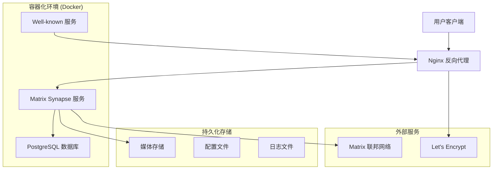
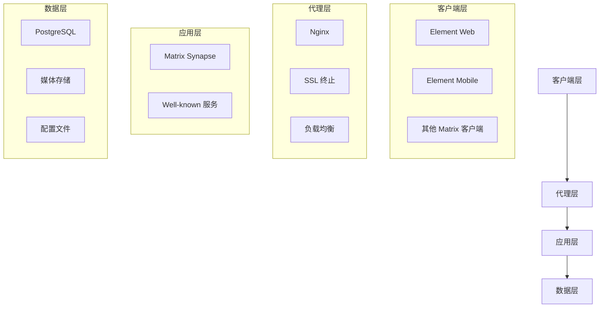
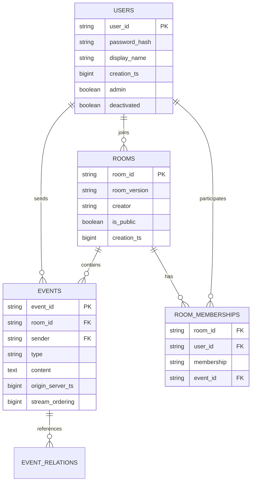
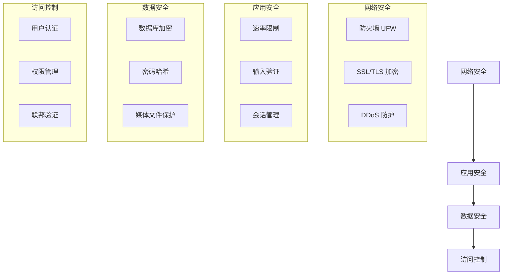
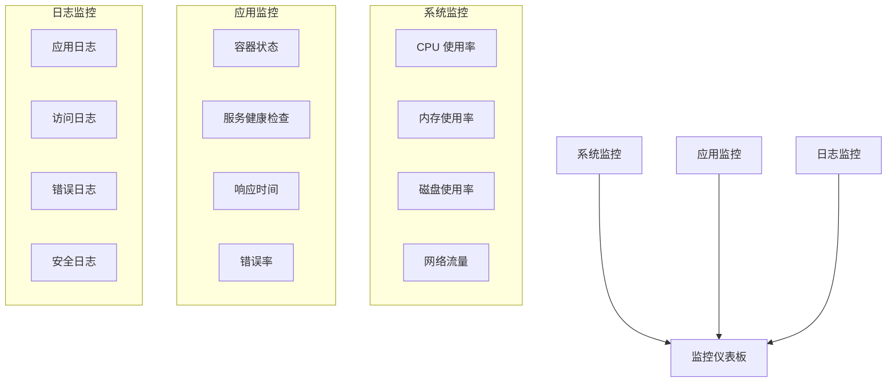
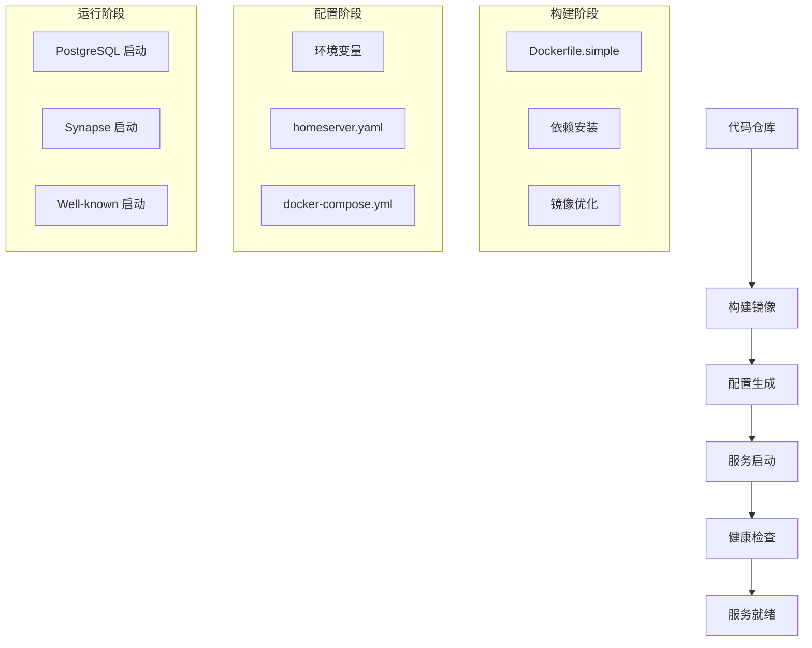
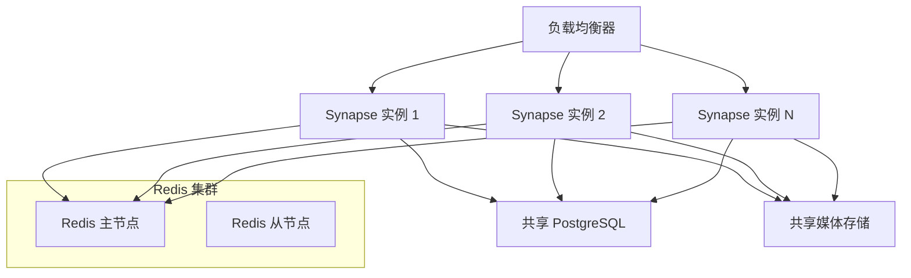
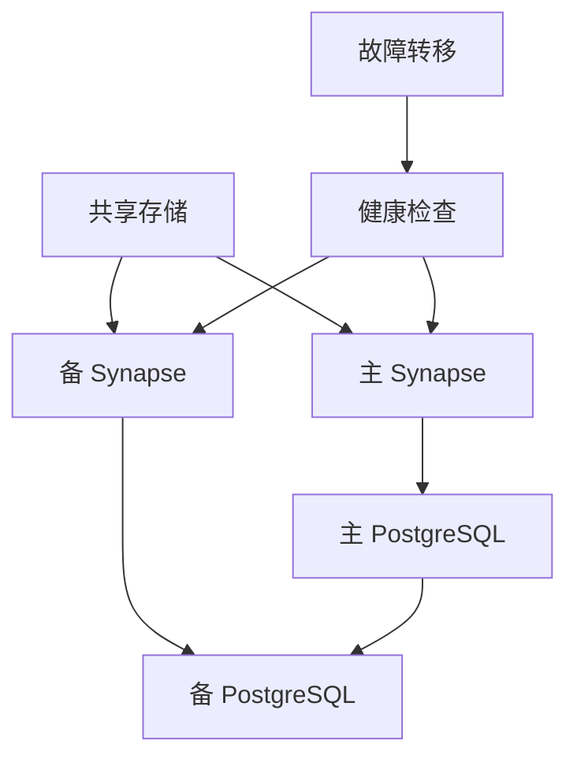
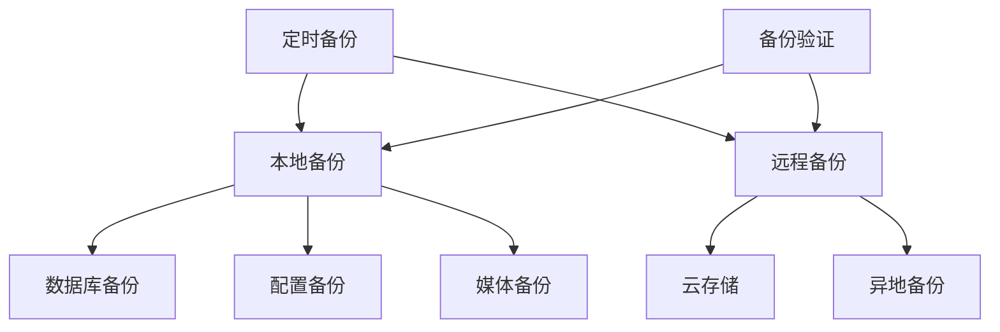
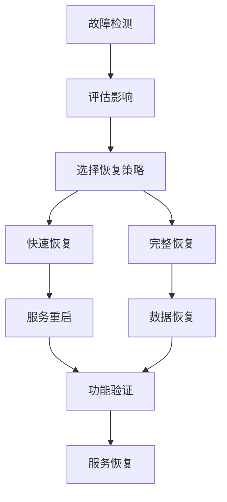

# Matrix Synapse 技术架构文档

## 1. 架构设计



## 2. 技术描述

### 2.1 核心技术栈
- **容器化**: Docker + Docker Compose
- **应用服务**: Matrix Synapse (Python)
- **数据库**: PostgreSQL 13
- **反向代理**: Nginx
- **SSL证书**: Let's Encrypt (Certbot)
- **基础镜像**: Python 3.9-slim

### 2.2 依赖组件
- **系统依赖**: libpq5, libffi8, libssl3, libjpeg62-turbo, libxml2, libxslt1.1
- **Python包**: matrix-synapse[all], psycopg2-binary
- **运行时**: curl, postgresql-client

## 3. 路由定义

| 路由 | 用途 | 服务 |
|------|------|------|
| / | Matrix 客户端 API | Synapse (端口 8008) |
| /_matrix/* | Matrix 服务端 API | Synapse (端口 8008) |
| /_synapse/* | Synapse 管理 API | Synapse (端口 8008) |
| /.well-known/matrix/* | 服务发现 | Well-known 服务 (端口 8080) |
| /health | 健康检查 | Nginx 状态页 |

## 4. 服务架构

### 4.1 服务层次图



### 4.2 容器服务定义

#### 4.2.1 Synapse 服务
```yaml
synapse:
  build: Dockerfile.simple
  ports: "127.0.0.1:8008:8008"
  resources:
    memory: 1280M (低配) / 2560M (标准)
    cpu: 0.6 (低配) / 1.2 (标准)
  volumes:
    - ./data:/data
    - ./media:/media
    - ./uploads:/uploads
    - ./logs:/logs
```

#### 4.2.2 PostgreSQL 服务
```yaml
postgres:
  image: postgres:13-alpine
  resources:
    memory: 384M (低配) / 1024M (标准)
    cpu: 0.3 (低配) / 0.5 (标准)
  environment:
    - 优化参数适配低配服务器
```

#### 4.2.3 Well-known 服务
```yaml
well-known:
  image: nginx:alpine
  ports: "0.0.0.0:8080:80"
  resources:
    memory: 32M
    cpu: 0.05
```

## 5. 数据模型

### 5.1 核心数据实体



### 5.2 关键数据表

#### 5.2.1 用户相关表
```sql
-- 用户表
CREATE TABLE users (
    name TEXT PRIMARY KEY,
    password_hash TEXT,
    creation_ts BIGINT,
    admin BOOLEAN DEFAULT FALSE,
    deactivated BOOLEAN DEFAULT FALSE
);

-- 用户配置表
CREATE TABLE user_threepids (
    user_id TEXT,
    medium TEXT,
    address TEXT,
    validated_at BIGINT,
    added_at BIGINT
);
```

#### 5.2.2 房间相关表
```sql
-- 房间表
CREATE TABLE rooms (
    room_id TEXT PRIMARY KEY,
    room_version TEXT,
    creator TEXT,
    is_public BOOLEAN,
    creation_ts BIGINT
);

-- 房间成员表
CREATE TABLE room_memberships (
    room_id TEXT,
    user_id TEXT,
    sender TEXT,
    membership TEXT,
    event_id TEXT,
    PRIMARY KEY (room_id, user_id)
);
```

#### 5.2.3 事件相关表
```sql
-- 事件表
CREATE TABLE events (
    event_id TEXT PRIMARY KEY,
    room_id TEXT,
    sender TEXT,
    type TEXT,
    content TEXT,
    origin_server_ts BIGINT,
    stream_ordering BIGINT
);

-- 事件状态表
CREATE TABLE current_state_events (
    room_id TEXT,
    type TEXT,
    state_key TEXT,
    event_id TEXT,
    PRIMARY KEY (room_id, type, state_key)
);
```

### 5.3 索引优化

```sql
-- 性能关键索引
CREATE INDEX events_stream_ordering ON events(stream_ordering);
CREATE INDEX events_room_id ON events(room_id);
CREATE INDEX room_memberships_room_id ON room_memberships(room_id);
CREATE INDEX room_memberships_user_id ON room_memberships(user_id);
CREATE INDEX current_state_events_room_id ON current_state_events(room_id);
```

## 6. 配置管理

### 6.1 配置文件层次

```
配置文件结构:
├── .env                    # 环境变量
├── data/
│   ├── homeserver.yaml     # 主配置文件
│   ├── log.config          # 日志配置
│   └── signing.key         # 签名密钥
├── docker-compose.simple.yml # 容器编排
└── well-known/
    └── .well-known/matrix/ # 服务发现
```

### 6.2 配置优化策略

#### 6.2.1 低配服务器优化 (1CPU/2GB)
```yaml
# 内存优化
caches:
  global_factor: 0.2
  event_cache_size: 500

# 数据库连接优化
database:
  args:
    cp_min: 1
    cp_max: 2

# 功能限制
max_upload_size: 8M
use_presence: false
enable_metrics: false
```

#### 6.2.2 标准服务器配置 (2CPU/4GB)
```yaml
# 内存优化
caches:
  global_factor: 0.5
  event_cache_size: 2000

# 数据库连接优化
database:
  args:
    cp_min: 2
    cp_max: 5

# 功能启用
max_upload_size: 50M
use_presence: true
enable_metrics: true
```

## 7. 安全架构

### 7.1 安全层次



### 7.2 安全配置

#### 7.2.1 网络安全
```bash
# 防火墙规则
ufw allow 22/tcp      # SSH
ufw allow 80/tcp      # HTTP
ufw allow 443/tcp     # HTTPS
ufw allow 8008/tcp    # Synapse (仅本地)
ufw allow 8080/tcp    # Well-known
```

#### 7.2.2 应用安全
```yaml
# 速率限制配置
rc_message:
  per_second: 0.5
  burst_count: 10

rc_registration:
  per_second: 0.0017  # 10分钟间隔
  burst_count: 1

rc_login:
  address:
    per_second: 0.17
    burst_count: 3
```

## 8. 监控架构

### 8.1 监控组件



### 8.2 监控指标

#### 8.2.1 系统指标
```bash
# CPU 使用率
top -bn1 | grep "Cpu(s)"

# 内存使用率
free -h

# 磁盘使用率
df -h

# 网络连接
netstat -an | grep :8008
```

#### 8.2.2 应用指标
```bash
# 容器状态
docker compose ps

# 容器资源使用
docker stats --no-stream

# 健康检查
curl -f http://127.0.0.1:8008/_matrix/client/versions
```

## 9. 部署架构

### 9.1 部署流程



### 9.2 部署策略

#### 9.2.1 一键部署
```bash
# deploy-simple.sh 脚本流程
1. 检查系统依赖
2. 安装 Docker 和 Docker Compose
3. 生成配置文件
4. 构建 Docker 镜像
5. 启动服务容器
6. 验证服务状态
```

#### 9.2.2 手动部署
```bash
# 分步部署流程
1. 环境准备
2. 依赖安装
3. 配置文件创建
4. 镜像构建
5. 服务启动
6. 功能验证
```

## 10. 扩展架构

### 10.1 水平扩展



### 10.2 高可用架构



### 10.3 性能优化

#### 10.3.1 缓存策略
```yaml
# Redis 缓存配置
redis:
  enabled: true
  host: redis
  port: 6379
  
# 应用缓存配置
caches:
  global_factor: 1.0
  event_cache_size: 10000
  sync_response_cache_duration: 2m
```

#### 10.3.2 数据库优化
```sql
-- 分区表
CREATE TABLE events_2023 PARTITION OF events
FOR VALUES FROM ('2023-01-01') TO ('2024-01-01');

-- 读写分离
CREATE USER synapse_readonly WITH PASSWORD 'readonly_password';
GRANT SELECT ON ALL TABLES IN SCHEMA public TO synapse_readonly;
```

## 11. 故障恢复架构

### 11.1 备份策略



### 11.2 恢复流程



---

## 总结

本技术架构文档详细描述了 Matrix Synapse 项目的:

1. **整体架构**: 基于 Docker 容器化的微服务架构
2. **技术栈**: Python + PostgreSQL + Nginx + Docker
3. **数据模型**: Matrix 协议的核心数据结构
4. **安全设计**: 多层次的安全防护机制
5. **监控体系**: 全方位的系统和应用监控
6. **部署策略**: 一键部署和手动部署两种方式
7. **扩展能力**: 支持水平扩展和高可用部署
8. **故障恢复**: 完整的备份和恢复机制

该架构特别针对 1CPU/2GB RAM 的低配服务器进行了优化，同时保持了良好的扩展性和可维护性。